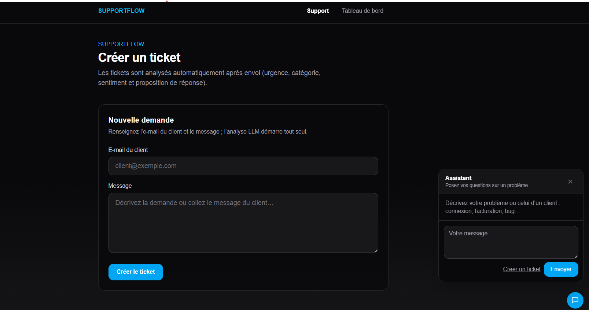
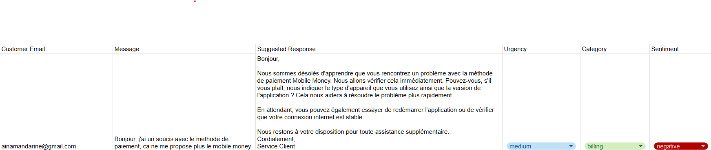

# Support Flow

A small **practice** project for experimenting with **agentic workflows** (tool orchestration, automated decisions, integrations) in a **customer support** context.

This repo is not a finished product: it’s a learning playground for combining a real-time backend, LLMs, and external automations.

## What is it?

A **customer support** app: messaging / agent-style flows for handling user requests, with a backend layer and integration hooks.

## Features

- **Chatbot**: helps customers **when they run into issues** (LLM-assisted replies, streaming conversation).
- **Ticket creation**: if **chat doesn’t resolve** the issue, users can **open a form** to **create a ticket** and escalate to the support team.

## Screenshots

**Support page** — chat assistant and ticket form:

**Spreadsheet** (e.g. via n8n _Append row_) — ticket stored with LLM-derived fields (urgency, category, sentiment, suggested reply):

## Stack

| Piece                                                         | Role                                                                                                                                                                       |
| ------------------------------------------------------------- | -------------------------------------------------------------------------------------------------------------------------------------------------------------------------- |
| **[Next.js](https://nextjs.org)**                             | Web UI and API routes (e.g. chat).                                                                                                                                         |
| **[Convex](https://convex.dev)**                              | Real-time backend, data, and server-side functions.                                                                                                                        |
| **[Vercel AI SDK](https://ai-sdk.dev)** + **`@ai-sdk/react`** | API side: `streamText`, UI message format, etc. React side: **ready-made hooks** (`useChat`, etc.) so you can wire up streaming chat without reinventing everything.       |
| **[OpenRouter](https://openrouter.ai)**                       | Access to LLMs via an OpenAI-compatible API; here we use **free-tier models** (e.g. `openrouter/free` router or a `:free` variant) with an OpenRouter API key.             |
| **[n8n](https://n8n.io)**                                     | Automation: for example, after a user **creates a ticket**, a workflow **appends a row** to a **spreadsheet** (e.g. Google Sheets) so support / ops can track the request. |
